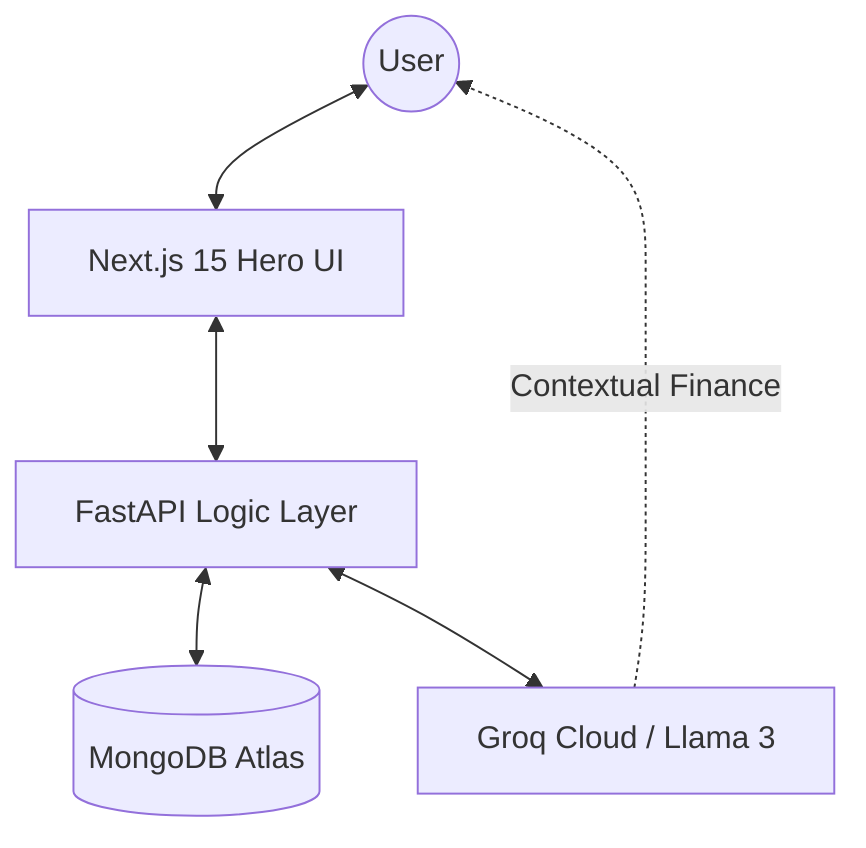

# 🚀 AI Money Mentor — Your Intelligent Financial Navigator

[](https://github.com/charitarth2636/AI_money_mentor)
[](LICENSE)
[](https://nextjs.org/)
[](https://fastapi.tiangolo.com/)

**AI Money Mentor** isn't just a chatbot; it's a sophisticated "Intelligent Financial System" designed to transform complex numbers into a clear, actionable roadmap for wealth building. Built for the modern Indian user, it combines real-time data tracking with human-like AI guidance.

---

## 🚀 Project Overview

Most people struggle with financial literacy not because they lack data, but because they lack **context**. Spreadsheets are cold, and generic advice is boring. 

**AI Money Mentor** solves this by creating a **Deterministic Financial Ecosystem**. It tracks your real-time transactions, monitors your life goals, and uses a personalized AI Mentor to give advice based on *ground-truth* data, not guesses.

- **Problem:** Scattered financial data and robotic, impersonal advice.
- **Solution:** A unified dashboard with a smart, human-like AI advisor.
- **Impact:** Shift from mindless spending to goal-oriented wealth creation.

---

## ✨ Features

- **🧠 Human-Like AI Mentor:** A smart, context-aware chatbot that detects intent (Greetings vs. Queries) and mirroring your language (English/Hinglish).
- **📊 Real-Time Financial Hub:** Interactive charts and bento-style cards showing Liquidity, Outflow, and Investment Health.
- **📈 Dynamic Cashflow Trends:** Visual representations of your income vs. expenses over time, powered by real database aggregations.
- **🎯 Precision Goal Tracking:** Set, edit, and track milestones like "₹12 Lakh Car" or "Emergency Fund" with real-time progress bars.
- **💸 Full Transaction Management:** Seamless CRUD operations for adding, editing, and deleting income/expense entries.
- **🛡️ Data Integrity:** Every insight is driven by your database, ensuring 100% accuracy in financial reporting.

---

## 🧠 How It Works (Architecture)

The system follows a modern **Decoupled Architecture**:



1.  **Data Ingestion:** User inputs transactions or goals via the Next.js frontend.
2.  **Processing:** FastAPI backend validates data and performs deterministic financial calculations.
3.  **Intelligence:** The AI Mentor fetches your real-time aggregates to provide "grounded" advice (it knows your real net worth before speaking).
4.  **Sync:** State-of-the-art React reactivity ensures the dashboard updates instantly on every change.

---

## 🛠 Tech Stack

- **Frontend:** Next.js 15 (App Router), Tailwind CSS 4, Framer Motion (Animations), Recharts.
- **Backend:** Python FastAPI, Pydantic (Data Validation), Uvicorn.
- **Database:** MongoDB (NoSQL) for flexible financial schema design.
- **AI Engine:** Groq SDK (Llama 3-70B) for lightning-fast inference.
- **Security:** JWT-based Authentication & Environment-level secret management.

---

## 📊 Key Functionalities

- **Transactional Engine:** Handles Categorized spending patterns (Food, Rent, Salary, etc.).
- **Wealth Insight:** Displays "Financial Efficiency" score based on the 50/30/20 rule.
- **Bento Dashboards:** Premium dark-themed UI for a high-end startup feel.
- **Smart Onboarding:** Captures your initial financial identity to build a custom plan.

---

## 💡 Unique Selling Points (USP)

- **Mirror-Language AI:** The first mentor that talks to you like a real friend in Hinglish/English.
- **Deterministic AI:** Unlike other bots, this one doesn't "hallucinate" numbers. It reads your DB and tells the truth.
- **Zero-Friction UX:** Simple, beautiful, and "Wow" aesthetics designed for high engagement.

---

## 🧪 How to Run Locally

### Prerequisites:
- Node.js 20+
- Python 3.9+
- MongoDB Instance (Atlas or Local)

### 1. Clone the Repo
```bash
git clone https://github.com/charitarth2636/AI_money_mentor.git
cd AI_money_mentor
```

### 2. Setup Backend
```bash
cd backend
python -m venv venv
source venv/bin/activate  # On Windows: venv\Scripts\activate
pip install -r requirements.txt
# Create a .env file based on .env.example
# Run the server
uvicorn app.main:app --reload
```

### 3. Setup Frontend
```bash
cd ../frontend
npm install
# Run the dev server
npm run dev
```

---

## 📂 Project Structure

```text
AI_money_mentor/
├── backend/            # FastAPI Python Application
│   ├── app/            # Source code (routes, services, models)
│   ├── .env.example    # Template for secrets
│   └── main.py         # Entry point
├── frontend/           # Next.js React Application
│   ├── app/            # Next.js App Router (Dashboard, Mentor, Profile)
│   ├── components/     # Reusable UI (Cards, Charts, Tables, Modals)
│   └── public/         # Static assets
└── .gitignore          # Unified ignore rules
```

---

## 👨‍💻 Team Falcon001

- **Abhay Jagatiya** — Core Logic & Architecture
- **Charitarth Zinzuwadiya** — Full Stack Development & UI/UX
- **Vansh Ganchi** — Data Security & API Integration
- **Nandani Solgama** — Documentation & Research

---

## 📈 Future Improvements

- [ ] **PDF Statement Parser:** Upload bank PDFs to auto-sync transactions.
- [ ] **Investment Connect:** Real-time stock portfolio tracking via APIs.
- [ ] **Voice Mentor:** Talk to your financial mentor using Speech-to-Text.
- [ ] **Community Insights:** Benchmarking your savings against similar age groups.

---

## 🤝 Contribution

Contributions are welcome! Please feel free to submit a Pull Request.

## 📜 License

This project is licensed under the MIT License - see the placeholder [LICENSE](LICENSE) file for details.

---
**Built with ❤️ by Team Falcon001**
