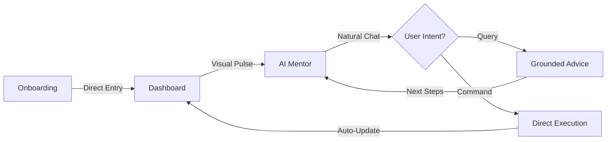
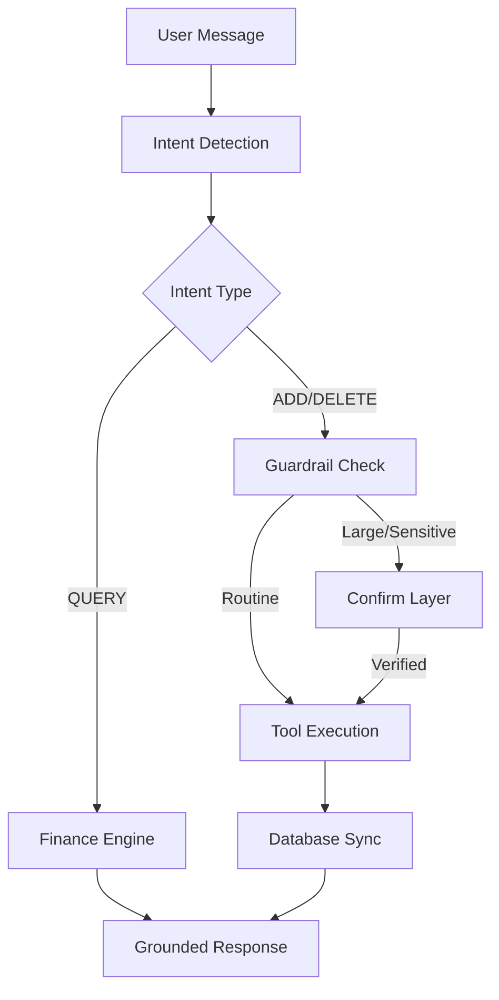

# 🚀 AI Money Mentor
> **Your Intelligent, Action-Capable Financial Navigator**

[](https://github.com/charitarth2636/AI_money_mentor)
[](LICENSE)
[](https://nextjs.org/)
[](https://fastapi.tiangolo.com/)

---

## 📌 Project Overview
**AI Money Mentor** is a "Hybrid Financial System" that transforms complex personal finance into a clear, actionable roadmap. Unlike traditional trackers, it combines a deterministic **Financial Engine** with an **Action-Capable AI Agent** that can execute your commands.

### 🚩 The Problem
Personal finance is often scattered, jargon-heavy, and reactive. Users have data, but No **context** and No **direct path to action**.

### 💡 The Solution
A unified dashboard powered by a "Ground-Truth" AI. The AI doesn't just give advice—it detects your intent and manages your transactions, goals, and plans directly through the backend.

---

## 🛤️ User Journey
A seamless path from data entry to financial freedom.



---

## 🧠 AI Decision Flow
Our AI follows a strict "Brain & Muscle" architecture to ensure accuracy and safety.



---

## ✨ Core Features
*   **🤖 Action-Capable AI:** Direct commands to add/delete transactions or set goals via natural language.
*   **🛡️ Safety Guardrails:** Mandatory confirmation for sensitive deletions or high-value actions (>₹50,000).
*   **📊 Bento Dashboard:** A high-end, visual summary of Liquidity, Outflow, and Investment Health.
*   **📈 Dynamic Cashflow:** Real-time trends that aggregate data across onboarding and manual entries.
*   **🎯 Precision Goals:** Multi-year roadmap calculations powered by 100% accurate backend logic.

---

## 🛠️ Tech Stack
*   **Frontend**: Next.js 15 (App Router), Tailwind CSS 4, Recharts.
*   **Backend**: Python FastAPI, Pydantic, Motor (MongoDB).
*   **AI Engine**: Groq SDK (Llama 3.1) for high-precision tool calling.
*   **Database**: MongoDB Atlas (NoSQL).

---

## 🏗️ How it Works
1.  **Orchestration**: The AI Mentor acts as an orchestrator, identifying user intents.
2.  **Determinism**: Financial metrics are never "estimated" by AI; they are calculated by the Python service layer.
3.  **Synchronization**: Every action triggers a "refresh key" in React, ensuring the dashboard is always live.
4.  **Security**: Strict `user_id` scoping for every database operation ensures privacy.

---

## 🧪 Quick Run

### 1. Backend
```bash
cd backend
pip install -r requirements.txt
# Set .env: MONGO_URI, SECRET_KEY, GROQ_API_KEY
uvicorn app.main:app --reload
```

### 2. Frontend
```bash
cd frontend
npm install
npm run dev
```

---

## 👨‍💻 Team Falcon001
- **Abhay Jagatiya**
- **Charitarth Zinzuwadiya**
- **Vansh Ghanchi**
- **Nandani Solgama**

---
**Built with ❤️ for Financial Clarity**
